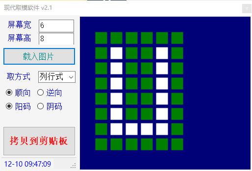
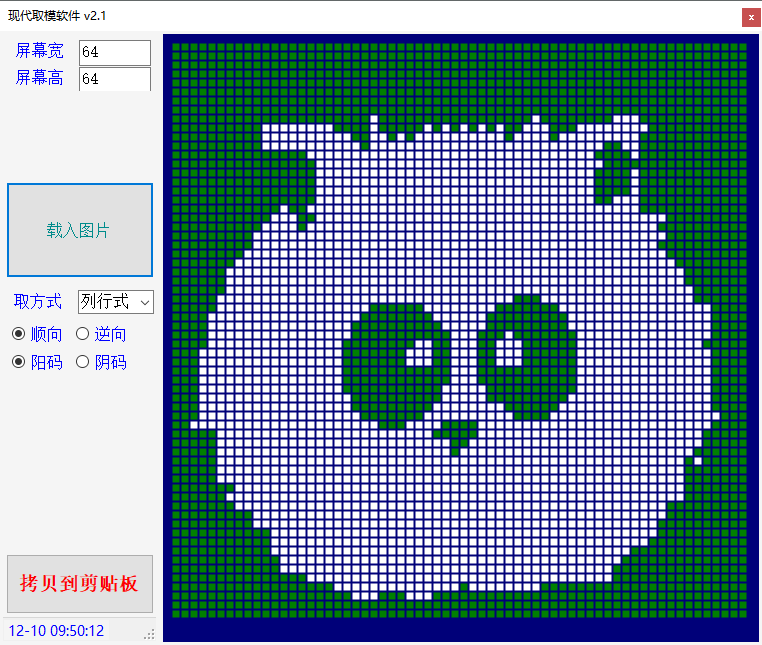

# 现代取模软件

>  wvv 2013

在自己驱动各种屏幕时，市面上的取模软件都比较古老，而且不好用，所以很久前开发了这款取模软件，可以动态设置屏幕尺寸，加载外部图片，也可以手绘界面。

操作方法：

* 设置好屏幕尺寸。

* 可以在网格上点鼠标左键进行图案绘制，点右键清除全部内容，双击清除某个像素点。
* 也可以载入外部图片，自动生成图案。
* 选好取模方式，确定好图案后，点击拷贝到剪贴板，字模数据已经拷贝好，粘贴到自己代码中就可以。
* 软件界面大小可以拖动，像素大小会自适应调整。

生成的数据类似以下格式

```
0x08,0x1E,0x72,0x24,0x3C,0x00
```

软件界面如下。



